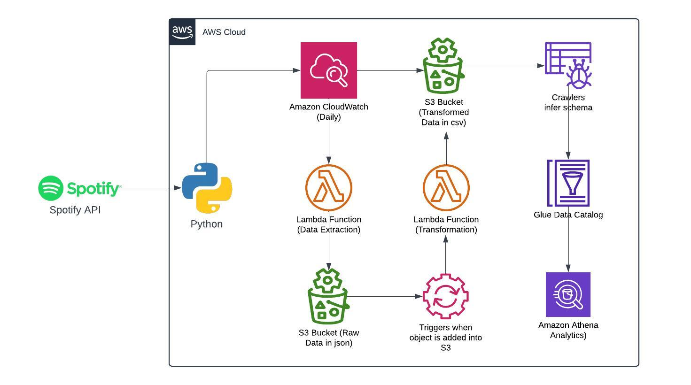
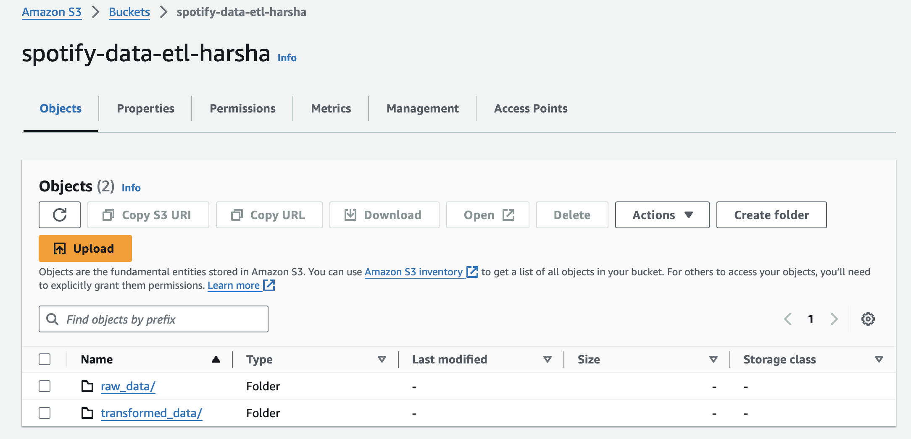
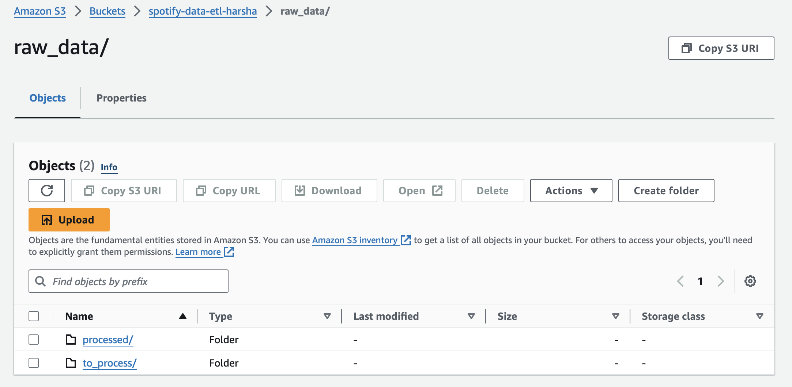
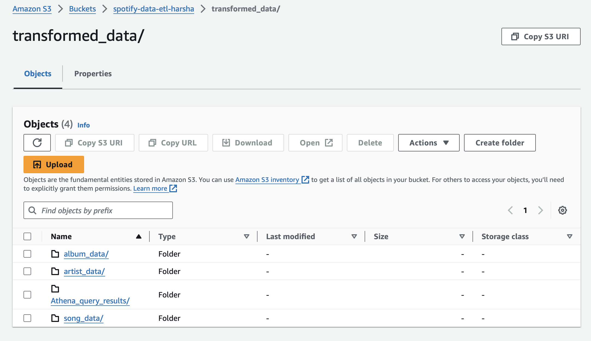
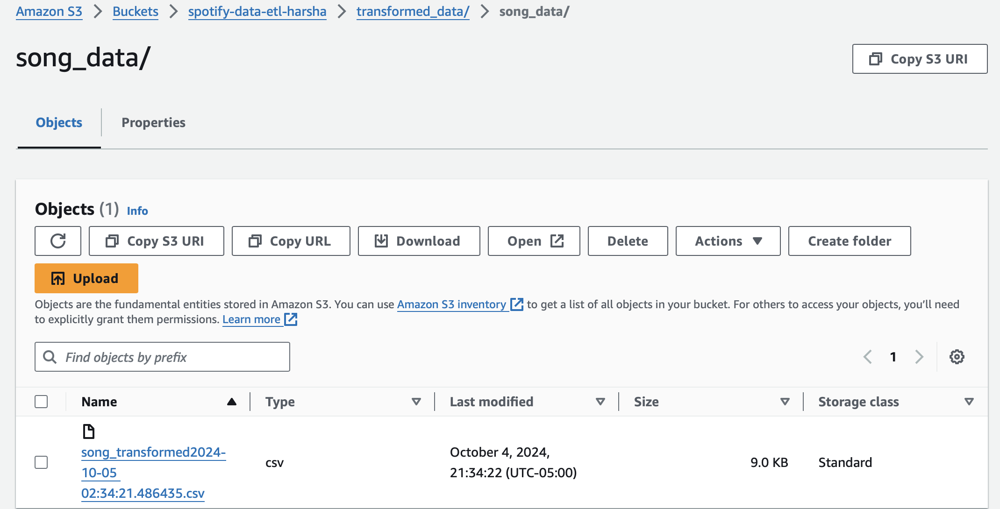
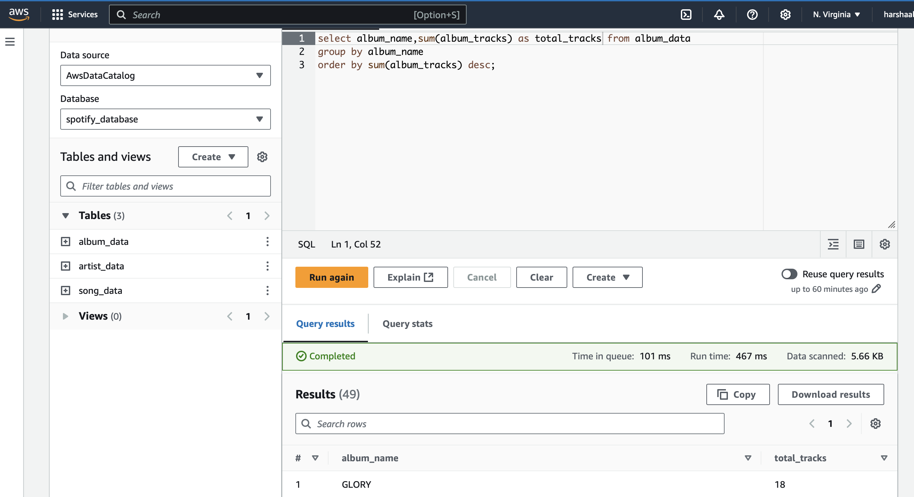

# Spotify Data End-to-End Analysis using AWS and Python

This project guides you through a Data Engineering journey, involving the ETL (Extract, Transform, Load) process by utilizing the Spotify API as the data source. Python and various AWS services are employed to accomplish this task.

## Architecture

## Technologies Used:
- **Programming Language:** Python

### AWS Cloud Services:
1. **AWS S3 Bucket**
2. **AWS Lambda Function**
3. **AWS CloudWatch**
4. **AWS Glue Crawler**
5. **AWS Athena**

To pull **Top 50 Indian Songs** data from the Spotify application, you need API keys (Client ID and Client Secret). Create an account on Spotify and obtain your API keys from the [Spotify Developer Dashboard](https://developer.spotify.com/dashboard).

Initially, the code was developed in Jupyter Notebook (`src="SpotifyData_ETL@jupy.ipynb"`), and later it was implemented as an AWS Lambda function.

### Lambda Function Details:
- The Lambda function does not have the built-in **Spotipy** package, so you need to add a layer by externally uploading the Spotipy package as a ZIP file(`src="spotipy_layer.zip"`).
- Similarly, the **Pandas** package is not available by default in Lambda, but it can be added as a layer in the AWS Layers section.

### Lambda Functions Created:
1. **spotify-data-extract**: This function extracts data from the Spotify API and stores it in an S3 bucket as JSON files.
2. **spotify-data-transform-load-s3**: This function transforms the data that read from JSON files, and stores the filtered data in the respective folders in CSV format.

### Functionality:
- Create two folders raw_data and transformed_data inside S3 bucket(spotify-data-etl-harsha)

- Inside raw_data folder create two more folders named **to_process, processed**. **spotify-data-extract** lambda function places the raw data file into *to_process* folder, later it picks up by **spotify-data-transform-load-s3** lambda function and move the file to *processed* folder.

- Create four folders, three for storing album, artist, and song data after executing **spotify-data-transform-load-s3** lambda function in csv format. While the fourth folder is for storing data related to **Athena** queries

- Create a trigger function using CloudWatch for **spotify-data-extract** lambda fucntion for daily run, and create a trigger using S3 to run **spotify-data-transform-load-s3** lambda function if any object is placed into the S3 bucket.

- Once **spotify-data-transform-load-s3** lambda function is done with its excution, the raw data file is moved to *processed* folder, while deleting from *to_process* folder. This helps in avoiding the file to run multiple times.
- Here's is a sample that song data file is moved to *song_data* folder. Likewise album and artist related data moves to *album_data* and *artist_data* folders respectively.

- Create three **crawlers** to crawl the data from three csv files. Navigate to **Tables** section and build an action to skip the first row while crawling as it contains index.

- Cross check the schemas and column names in the *Tables* section, as sometimes crawlers read it incorrectly and run the crawlers.
-Once the crawlers stopped, connect to **Athena** and check whether the data is populated appropiriately or not.

## Start Analysing
  

