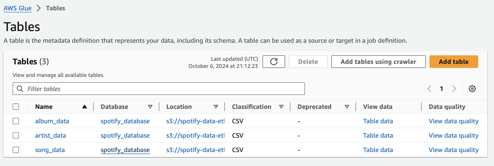

# Spotify Data End-to-End Analysis using AWS and Python

This project guides you through a Data Engineering journey involving the ETL (Extract, Transform, Load) process by utilizing the Spotify API as the data source. Python and various AWS services are employed to accomplish this task.

## Architecture

## Technologies Used:
- **Programming Language:** Python

### AWS Cloud Services:
1. **AWS S3 Bucket**
2. **AWS Lambda Function**
3. **AWS CloudWatch**
4. **AWS Glue Crawler and Glue Data Catalog**
5. **AWS Athena**

To pull **Top 50 Indian Songs** data from the Spotify application, you need API keys (Client ID and Client Secret). Create an account on Spotify and obtain your API keys from the [Spotify Developer Dashboard](https://developer.spotify.com/dashboard).

Initially, the code was developed in Jupyter Notebook (`src="SpotifyData_ETL@jupy.ipynb"`), and later it was implemented as an AWS Lambda function.

### Lambda Function Details:
- The Lambda function does not include the built-in **Spotipy** package, so you need to add a layer by externally uploading the Spotipy package as a ZIP file (`src="spotipy_layer.zip"`).
- Similarly, the **Pandas** package is not available by default in Lambda but can be added as a layer in the AWS Layers section.

### Lambda Functions Created:
1. **spotify-data-extract**: This function extracts data from the Spotify API and stores it in an S3 bucket as JSON files.
2. **spotify-data-transform-load-s3**: This function transforms the data read from JSON files and stores the filtered data in the respective folders in CSV format.
- Refer [SpotifyData_Extract.py](src/SpotifyData_Extract@lambda.py) and [SpotifyData_Transform.py](src/SpotifyData_Transform@lambda.py) for programming codes for both lambda functions.

### Functionality:
- Create two folders: `raw_data` and `transformed_data` inside the S3 bucket (`spotify-data-etl-harsha`).

- Inside the `raw_data` folder, create two additional folders named **to_process** and **processed**. The **spotify-data-extract** Lambda function places the raw data file into the *to_process* folder. Later, it is picked up by the **spotify-data-transform-load-s3** Lambda function and moved to the *processed* folder.

- Create four folders for storing album, artist, and song data after executing the **spotify-data-transform-load-s3** Lambda function in CSV format. The fourth folder is designated for storing data related to **Athena** queries.

- Create a trigger function using CloudWatch for the **spotify-data-extract** Lambda function to run daily, and create a trigger using S3 to invoke the **spotify-data-transform-load-s3** Lambda function whenever an object is placed into the S3 bucket.

- Once the **spotify-data-transform-load-s3** Lambda function has completed execution, the raw data file is moved to the *processed* folder, and it is deleted from the *to_process* folder. This helps to avoid processing the same file multiple times. Here is a sample of a song data file that is moved to the *song_data* folder. Likewise, album and artist-related data are moved to the *album_data* and *artist_data* folders, respectively.

- Create three **crawlers** to crawl the data from the three CSV files. While creating the crawlers, ensure to provide a database if one exists; otherwise, create a new one. Navigate to the **Tables** section and configure it to skip the first row while crawling, as it contains the index.

- Cross-check the schemas and column names in the *Tables* section, as sometimes crawlers may read them incorrectly. After confirming, run the crawlers.
- Once the crawlers have completed, connect to **Athena** and verify whether the data is populated appropriately.

## Start Analyzing

Thank you! 😊
